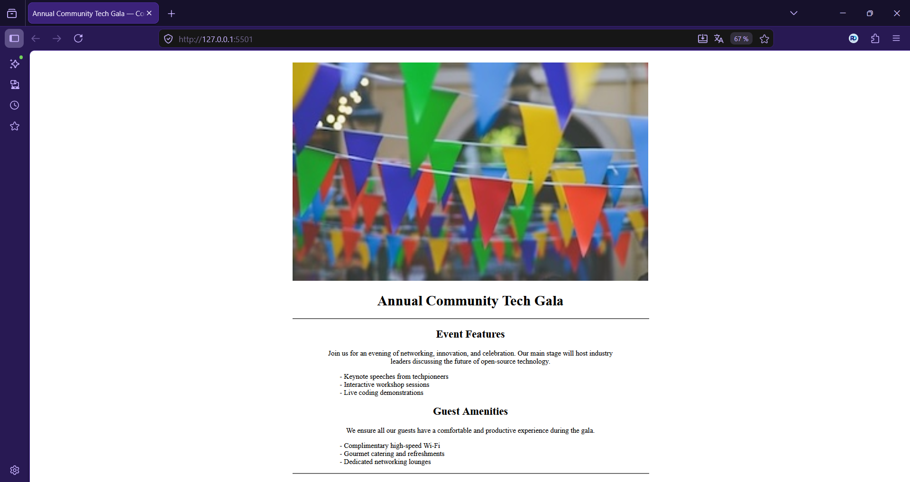

# Event Flyer Page

Page d'affiche d'événement construite en HTML/CSS pur, mettant en pratique les unités relatives et la fonction `calc()`.

---

 

---

## Capture d'écran

---

## Technologies

---

## Compétences mises en avant

- Structure sémantique HTML5 (`header`, `main`, `section`)
- Mise en page avec unités relatives (`vw`, `vh`, `%`)
- Dimensionnement dynamique avec `calc()`

---

## Ce que j'ai appris

- **`vw` / `vh` vs `%`** — `vw` et `vh` se basent toujours sur la fenêtre du navigateur, tandis que `%` dépend de l'élément parent. Utile pour créer des mises en page qui s'adaptent à l'écran sans JavaScript.
- **`calc()` pour des valeurs mixtes** — cette fonction permet de combiner des unités différentes (`100vh - 100px`), ce qui serait impossible avec une seule unité. C'est particulièrement pratique pour déduire des marges d'une hauteur.
- **`em` vs `rem`** — `rem` se base sur la taille de police racine (`<html>`), ce qui le rend plus prévisible que `em` qui hérite du parent. Pour la typographie, `rem` est plus fiable.

---

## Auteur

**DocariDR** — projet réalisé dans le cadre du cours [Responsive Web Design](https://www.freecodecamp.org/learn/responsive-web-design-v9/) de freeCodeCamp.